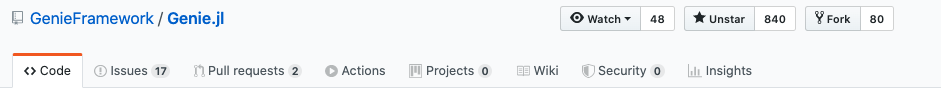
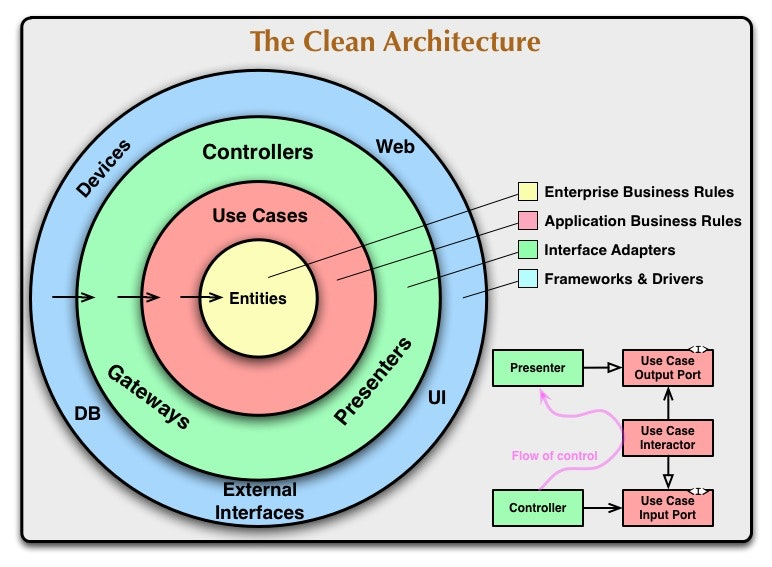
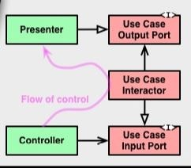

## WebFrameworkとしてGenie.jlという選択

---

## 自己紹介

- 塚本真人
- 株式会社Fusic
- 普段はRoRでweb開発してます
- 趣味: ポケモン
- qiita: https://qiita.com/TsuMakoto
- github: https://github.com/TsuMakoto


---

## アジェンダ

- 動機
- Genie.jlについて
- Clean Architecture
- Genie.jlのController
- Genie.jlのModel
- Genie.jlのView
- おまけ
- デメリット

---

## 動機
- Webの実装まで全てをJuliaで完結できたらよいのでは。。。？
  - 例えば、AI等の実装を行ったとき、わざわざAPI化するのもめんどい

- APIとして簡単に公開できたら。。。
  - frameworkを使えば、セキュリティ面から、デプロイ周りまで担保できる


### ならJuliaでWebFrameworkは？

---

## Genie.jl

---

## Genie.jlについて
[Welcome to Genie](https://genieframework.github.io/Genie.jl/documentation/1--Overview.html)

- Ruby On Railsや、Djangoをルーツにしている

- **設計はオリジナルである**

---

## よいところ
- クリーンな設計が可能
- 初期導入が簡単
- 作成されるコードはほぼ純Julia
  - 学習コストが低い
- github ⭐️が1000間近



---

## よいところ
- クリーンな設計が可能 ⬅️
- 初期導入が簡単
- 作成されるコードはほぼ純Julia
  - 学習コストが低い
- github ⭐️が1000間近


---

## Clean Architecture

### 関心ごとの分離で、変更に強い設計にする

よくみる図



---



## Clean Architecture

知っておくべきことは**クラスの**役割**説明できるようにする**

- 白抜きは汎化
- 黒矢印は依存の方向

---


## Clean Architecture
- controllerはUse Case Input Portへ依存する
- Use Case Input PortはUse Case Interactorで実装する
などなど

---

## コード

タスクを表示するコード

```julia

using Genie.Renderer
using SearchLight
using Tasks

function index()
  tasks = SearchLight.all(Tasks.Task)
  Renderer.Html.html(:tasks, :index, tasks = tasks)
end


```

---

## コード

```julia

using Genie.Renderer
using SearchLight
using Tasks

function index()
  tasks = SearchLight.all(Tasks.Task)
  Renderer.Html.html(:tasks, :index, tasks = tasks)
end

```

- 依存しているもの
  - Tasks
  - SearchLight
  - Renderer.Html

---

## 依存を少なくする

```julia

# GetTasks.jl
# 依存しているもの
import App.InputPorts: GetDatasets

mutable struct GetTasks <: GetDatasets
  model
  ormapper
  call::Function

  function getTasks(model, ormapper)
    ormapper.all(model)
  end

  GetTasks(model, ormapper;call=getTasks)
    = new(model, ormapper, () -> call(model, ormapper))
end


# Controller

function index(interactor::GetDatasets; render=Genie.Renderer.Html.html)
  tasks = interactor.call()
  render(:tasks, :index, tasks = tasks)
end

```

---

## 依存を少なくする

```julia

# GetTasks.jl
# 依存しているもの <= interfaceへ依存させている
import App.InputPorts: GetDatasets

mutable struct GetTasks <: GetDatasets
  model
  ormapper
  call::Function

  function getTasks(model, ormapper)
    ormapper.all(model)
  end

  GetTasks(model, ormapper;call=getTasks)
    = new(model, ormapper, () -> call(model, ormapper))
end


# Controller

function index(interactor::GetDatasets; render=Genie.Renderer.Html.html)
  tasks = interactor.call()
  render(:tasks, :index, tasks = tasks)
end

```

---

## Genie.jlではどう設計できるのか？

---

## アクションとルーティングが独立

[routing](https://github.com/GenieFramework/Genie.jl/blob/master/src/Router.jl)の実装をみると

**アクションの指定が自分で行える**ようになっている

```julia
function route(path::String,
               action::Function; method = GET,
               named::Union{Symbol,Nothing} = nothing)::Route

  r = Route(method = method, path = path, action = action, name = named)

  if named === nothing
    r.name = routename(r)
  end

  Router.push!(_routes, r.name, r)
end
```

---

## なにが嬉しいのか？

↓のようなコードをアクションにした時、使うユースケースに依存しにくくなる

```julia

# app/resources/tasks/TasksController.jl

module TasksController

function index(interactor::GetDatasets; render=Genie.Renderer.Html.html)
  tasks = interactor.call()
  render(:tasks, :index, tasks = tasks)
end

end

```

---

## コード

自分で設定した関数をアクションへ設定することが可能になる

```julia
# routes.jl

using TasksController
using Tasks
using SearchLight

function action
  TasksController.index(GetTasks(Tasks.Task, SearchLight))
end

route("/tasks", action)
```

---

## さらに依存関係を減らす
このままだと、コントローラがアクションに依存する形になる
  - ちなみにほとんどのWebFrameworkがこの形式になっている

---

## シングルアクションコントローラ
以下のように変更する

```julia

# app/resources/tasks/IndexTasks.jl

module IndexTasks

function call(interactor::GetDatasets; render=Genie.Renderer.Html.html)
  tasks = interactor.call()
  render(:tasks, :index, tasks = tasks)
end

end

# routes.jl

function action
  IndexTasks.call(GetTasks(Tasks.Task, SearchLight))
end

route("/tasks", action)
```

---

## Model
モデルとDBが非依存
モデルの基本実装は以下のみである

```julia
module Tasks

mutable struct Task <: AbstractModel
  id::DbId = DbId()
  title::String = ""
  contents::String = ""
end

end
```

---

## saveメソッドは誰がもってるのか？
SearchLight.jlというORMの層が担っている

SearchLight.jlでDBを管理しているので、DBの切り替えが用意

```julia

task = Tasks(title="勉強会", contents="JuliaTokaiの資料を準備する")

SearchLight.save!(task)

```

---

## View
テンプレートファイルはjuliaで記述できる

フレームワークへ依存せず、そのまま移行可能

```julia
# index.html.jl
<%
  Html.ul() do
    if length(@vars(:tasks)) == 0
      "タスクがありません。"
    else
      @foreach(@vars(:tasks)) do task
        "<li>$(task.contents)</li>"
      end
    end
  end
%>
```

---

## 結論

### Genie.jlではcleanな設計が可能！！！

---

## おまけ

- jsonの送信も簡単にできる
  - frontendとも簡単にきりわけが可能
- ライトなサービスであれば、routes.jlのみで作成可能
- 基本すべてjuliaの構文のみで書ける

---

## デメリット
- 起動がなぜかおそい
- 設定周りがわりとしんどい
- include関係で結構コケる(らしい)
- Documentが貧弱
  - まだ開発段階といったところ

---

## おわりに
すぐにProductへ適応とはいかないかもしれないが、
選択肢のひとつとしてどうでしょうか?
